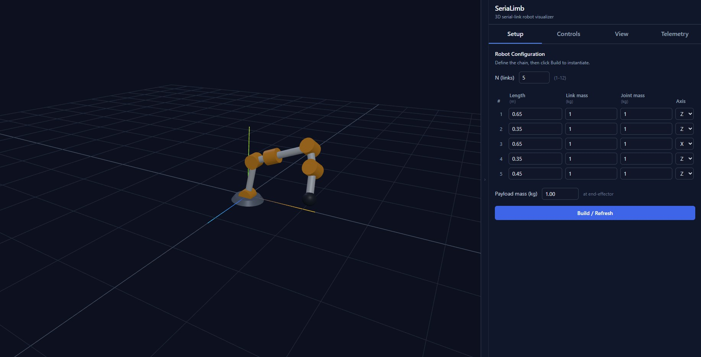

# SeriaLimb



A browser-based 3D visualizer for **N-link revolute serial robots**. Define the chain, drive each joint angle with a slider, run animated motions, and inspect per-joint telemetry.

---

## Prerequisites

- **Node.js 18+** (tested on 22.x) and npm.
- A modern browser with WebGL (Chrome, Firefox, Edge, Safari).

---

## Install & run

```bash
npm install
npm run dev
```

Vite will print a local URL (e.g. `http://localhost:5173/`). Open it in your browser.

| Command | What it does |
| --- | --- |
| `npm run dev` | Start the dev server with hot reload. |
| `npm run build` | Produce a production bundle in `dist/`. |
| `npm run preview` | Serve the production bundle locally. |

---

## Using the app

The window is split 70 / 30: the **3D viewport** on the left and the **sidebar** (Setup / Controls / View / Telemetry tabs) on the right. The sidebar can be collapsed with the thin strip on its left edge.

### Viewport

- **Left-click + drag** (empty space) — orbit the camera.
- **Right-click + drag** — pan.
- **Scroll wheel** — zoom.
- **Left-click + drag on the green tip** — inverse kinematics. The chain follows the cursor (CCD solver) on a plane perpendicular to the camera. Sliders update live, motion can be recorded as a keyframe.
- **Left-click + drag on an amber joint cylinder** — forward kinematics. That joint rotates about its own axis; downstream links carry along.
- The grid is on the XZ plane (Y up); the axes helper at the base shows X (red), Y (green), Z (blue).
- Color key: **slate** disc = base, **amber** cylinders = joints (cylinder axis = rotation axis), **blue** cylinders = links, **green** sphere = end-effector / payload.
- Joint and link cylinder radii scale with `√mass` so heavier elements are visually larger.

### Setup tab

Defines the robot's structure. Edits stage locally — nothing changes in the 3D scene until you click **Build / Refresh**.

| Field | Meaning |
| --- | --- |
| `N (links)` | Number of revolute joints / links in the chain (1–12). |
| `Length (m)` | Link length measured along its local +X axis. |
| `Link mass (kg)` | Point mass at the **center of the link** (link midpoint). |
| `Joint mass (kg)` | Actuator mass at the **joint pivot**. |
| `Axis` | Rotation axis for this joint: `X`, `Y`, or `Z` (default `Z`). |
| `Min θ` / `Max θ` | Per-joint angle limits in degrees (range −180°…180°; defaults ±180°). Sliders, IK, drag, and planner all clamp to these. |
| `Payload mass (kg)` | Point mass at the end-effector tip. |

Joint angles are preserved across rebuilds when the link index still exists and remain inside the (possibly tightened) limits.

**Export CSV / Load CSV** — save or restore the full configuration (links, limits, current pose, payload) as a CSV file. The format is a commented header followed by one row per link:

```
# SeriaLimb configuration
# payloadMass=1.0
index,length_m,linkMass_kg,jointMass_kg,axis,minAngleDeg,maxAngleDeg,angleDeg
1,1.0,1.0,1.0,z,-180,180,0
2,0.8,0.8,0.9,y,-90,90,15
3,0.6,0.5,0.7,z,-120,120,-30
```

Loading a CSV applies immediately (it does not stage).

### Controls tab

Three modes toggled at the top: **Manual**, **Planner**, **Sequence**. **Reset to 0** is available in any mode and cancels any running motion or sequence playback.

#### Manual mode

One row per joint with a slider (−180° to +180°) and a number input. Changes apply to the 3D model immediately.

#### Planner mode

Animates the robot from its current pose to a set of target joint angles.

| Control | Purpose |
| --- | --- |
| `Duration (s)` | Motion duration, 0–120 s. `0` snaps instantly. |
| `Easing` | `Smooth` (cubic ease-in-out) or `Linear`. |
| Per-joint target | The angle θᵢ to reach. The *now* readout shows the live current angle. |
| `Snap to current` | Copies the current pose into the targets. |
| `Zero targets` | Sets every target to 0°. |
| `Run` | Starts the motion; all joints depart and arrive together. |
| `Cancel` | Freezes the robot at its current pose. |

Inputs are disabled while a motion is running. Switching to Manual mode also cancels any active motion.

Each completed (or cancelled) planner session is automatically recorded and available in the **Telemetry tab**.

#### Sequence mode

Captures an ordered list of poses (keyframes) and plays the planner through them sequentially. Pose the robot using any combination of dragging, manual sliders, or planner runs, then snapshot.

| Control | Purpose |
| --- | --- |
| `Per-segment duration (s)` | Time the planner takes to move between consecutive keyframes. |
| `Easing` | `Smooth` or `Linear` — applied to each segment. |
| `+ Add keyframe from current pose` | Appends a keyframe holding the current joint angles. |
| Per keyframe: `Save current` | Overwrites that keyframe with the current pose. |
| Per keyframe: `Go to` | Snaps the robot to that keyframe (no animation). |
| Per keyframe: `Delete` | Removes that keyframe. |
| `Play sequence` | Snaps to keyframe 1, then animates 1→2→3→… in order. |
| `Cancel` | Freezes mid-sequence. |
| `Clear all` | Removes every keyframe. Keyframes otherwise persist across structure edits, mode switches, and replays. |

Replays always start from the first keyframe. Keyframes captured against an old structure (different `N` or axis) are padded/truncated to fit the current robot — `Clear all` if you'd rather start fresh.

The whole sequence is recorded as a **single continuous telemetry session** (one per playback) — segment boundaries become inflection points on the velocity / torque / power plots rather than separate sessions.

### View tab

Toggle center-of-mass visualizations. Markers update in real time and render on top of geometry (depth-test disabled).

| Toggle | Visual | What it shows |
| --- | --- | --- |
| **Joint CoM markers** | Amber crosshairs | Point mass at each joint pivot |
| **Link & payload CoM markers** | Sky-blue (links) + lime (payload) crosshairs | Point mass at each link midpoint and at the end-effector |
| **Assembly CoM** | White sphere + violet rings | Weighted CoM of the full robot (all joints + links + payload) |

### Telemetry tab

Shows per-joint time-series plots recorded from the most recent planner session(s). Up to 5 sessions are retained.

**Session selector** — shown when more than one session exists. Pick any session from the dropdown.

**Clear** — removes all stored sessions.

**Export CSV** — downloads a `.csv` with one row per recorded sample:

```
time_s, θ1_deg … θN_deg, ω1_degs … ωN_degs, τ1_Nm … τN_Nm, P1_W … PN_W
```

**Export PNG** — downloads a single composite image of all four charts.

---

## Telemetry calculations

Telemetry is sampled once per `requestAnimationFrame` tick (typically ~60 Hz) for the duration of a planner motion. Four quantities are computed for each joint at each sample.

### Joint angle θᵢ (°)

Taken directly from the robot state after the planner interpolates the pose for that frame. No transformation needed.

### Angular velocity ωᵢ (°/s)

Finite difference between consecutive samples:

```
ωᵢ[k] = (θᵢ[k] − θᵢ[k−1]) / Δt
```

where `Δt` is the wall-clock time between frames in seconds. The first and last samples are defined as zero (motion has not started / has just completed).

### Gravity torque τᵢ (N·m)

A **quasi-static** model: the torque joint `i` must exert to hold all distal masses stationary against gravity. Dynamic effects (inertia, Coriolis, damping) are not included.

**Assumptions**

- Gravity acts in the −Y world direction, magnitude g = 9.81 m/s².
- Each link is a point mass at its midpoint (halfway between its two joint pivots in world space).
- Each joint is a point mass at its pivot.
- The payload is a point mass at the end-effector tip.

**Moment arm per joint axis**

For a mass at world position **p** relative to joint `i`'s pivot **pᵢ**, let **r** = **p** − **pᵢ**. The torque contribution about joint `i`'s rotation axis due to a vertical force is:

```
τ_contrib = mass × g × moment_arm
```

The moment arm (derived from the cross-product `r × ĝ` projected onto the joint axis, where ĝ = (0,−1,0)) depends only on the joint's rotation axis:

| Joint axis | Moment arm |
| --- | --- |
| X | `|r.z|` |
| Y | `0` (vertical axis — no gravity coupling) |
| Z | `|r.x|` |

**Summation**

For joint `i` (0-indexed), masses distal to it are:

- **Link j CoM**, for j = i … N−1: mass = `links[j].linkMass`, position = midpoint of `jointPositions[j]` and `jointPositions[j+1]`
- **Joint j+1 mass**, for j = i … N−2: mass = `links[j+1].jointMass`, position = `jointPositions[j+1]`
- **Payload**: mass = `payloadMass`, position = `jointPositions[N]` (end-effector tip)

Joint `i`'s own mass sits at the pivot (zero moment arm) and contributes nothing.

World positions are computed via forward kinematics (`accumulate` in `src/kinematics/forwardKinematics.js`) at the current joint angles for each sample.

### Joint power Pᵢ (W)

```
Pᵢ = τᵢ × ωᵢ_rad
```

where `ωᵢ_rad = ωᵢ × π/180` (angular velocity in rad/s).

Sign convention:

- **Positive** — joint is moving against gravity (motor is driving the load).
- **Negative** — gravity is assisting the motion (motor is braking or coasting).

---

## Kinematics

Each joint `i` applies the transform

```
Tᵢ = R_axis_i(θᵢ) · Tx(Lᵢ)
```

where `R_axis` rotates about the selected local axis and `Tx(L)` translates along local +X. The world-frame transform for the tip is `T₁ · T₂ · … · Tₙ`. The Three.js scene graph nests these as `Group` objects so rotations propagate to downstream links automatically.

---

## Project layout

```
SeriaLimb/
├── index.html
├── package.json
└── src/
    ├── main.js                    # entry: wires state, scene, UI, drag controls, keyframe store
    ├── style.css                  # Tailwind v4 + component styles
    ├── model/
    │   ├── robotState.js          # state store (pub/sub: 'structure', 'angles'); per-link angle limits
    │   └── configCsv.js           # serialize / parse the full robot config as CSV
    ├── kinematics/
    │   ├── forwardKinematics.js   # segmentTransform + accumulate → joint world positions
    │   └── inverseKinematics.js   # CCD solver for arbitrary per-joint axes
    ├── motion/
    │   ├── motionPlanner.js       # target angles, easing, rAF animation loop
    │   ├── telemetryRecorder.js   # per-frame angle/velocity/torque/power recorder; group mode for multi-segment runs
    │   └── keyframes.js           # keyframe store + sequence player
    ├── scene/
    │   ├── sceneManager.js        # renderer, camera, lights, orbit controls
    │   ├── robotMesh.js           # hierarchical robot Three.js tree; tags drag handles
    │   ├── comMarkers.js          # CoM crosshairs and assembly sphere
    │   ├── viewState.js           # CoM visibility flags
    │   └── dragControls.js        # pointer/raycaster handlers — IK on tip, FK on joints
    └── ui/
        ├── tabs.js
        ├── setupPanel.js
        ├── controlsPanel.js       # manual + planner + sequence modes
        ├── viewPanel.js           # CoM toggles
        └── telemetryPanel.js      # Chart.js plots + CSV/PNG export
```

## Tech stack

- **Vite 5** — dev server and bundler.
- **Three.js** — scene graph, `Matrix4`, `OrbitControls`.
- **Tailwind CSS v4** — styling via the `@tailwindcss/vite` plugin.
- **Chart.js** — time-series line charts in the Telemetry tab.

---

## Roadmap

- JSON / URDF export of the current robot configuration.
- Save / load keyframe sequences across sessions.
- Full rigid-body dynamics (inertia tensors, Coriolis, damping) to extend the quasi-static torque model.
